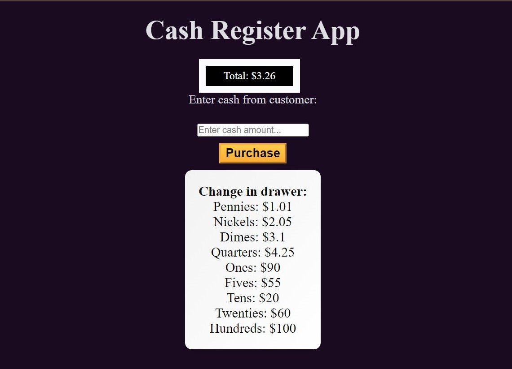

# Cash-register

This is the cash register  app that will return change to the customer based on the price of the item.the amount of cash provided by the customer, and the amount of cash in the cash drawer. You'll also need to show different messages to the user in different scenarios, such as when the customer provides too little cash or when the cash drawer doesn't have enough to issue the correct change.

Dimo link✨🔹 (https://walwalasafi.github.io/Cash-register/)

Technologies Used 🛠️
🔹HTML
🔹CSS
🔹java script

Rquirements# 

1◻◻:--- creat a new repository in your github

2️◻◻:--- Create a New Project Directory:

Open your terminal or command prompt. Navigate to the directory where you want to create your project. Run the following command to create a new directory for your project: bash Copy code mkdir documentation-project

3️◻◻:--- open HTML in any program such you want ssuch us: vscode, terminal and cmd.

4️◻◻:--- creat a  HTML file.

5◻◻:--- JavaScript: Implements validation logic using regular expressions and handles user interactions.

6◻◻:--- give a style to project by creating style.css file. 

7◻◻:--- use (git add, git commint, git push) in the git bash to push it in Github.

8◻◻:--- Make a string and uniqe project-Readme.md file.

Author 🔵✅
Github: WALWALA SAFI (https://github.com/WALWALASAFI/product-landing-page.git)

Email: walwala safi (walwalasafi99@gmail.com)
